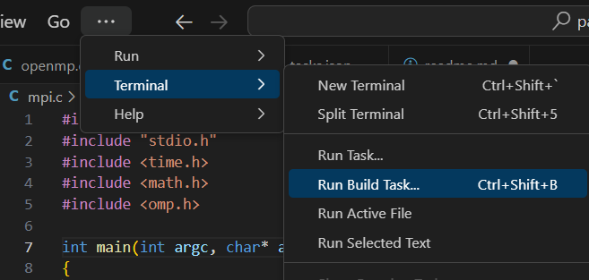

# Как я установил OpenMP и MPI?

Подробный гайд на [ютубе](https://youtu.be/T_BVqSya1Is?si=4Zt2uUxMk2udf6cU)

- Скачал MinGW
  - [Перешёл по ссылке](https://sourceforge.net/projects/mingw-w64/files/)
  - Выбрал версию. Мне подошла вот эта: 
  - Распаковал архив. Теперь папка mingw64 лежит по пути <code>C:\mingw64</code>
  - Добавил <code>C:\mingw64\bin</code> в системную переменную <code>Path</code>
  - Проверил, что всё поставилось командами <code>gcc --version</code> и <code>g++ --version</code>
- Скачал MPI
  - [Перешёл по ссылке](https://www.microsoft.com/en-us/download/details.aspx?id=57467)
  - Нажал Download и выбрал оба файла для скачивания
  - Запустил .exe файл и установил его в <code>C:\MSMPI</code>
  - Запустил .msi файл и установил его в <code>C:\MSMPI\SDK</code>
  - Проверил, что всё поставилось командой <code>set msmpi</code>

# OpenMP

## Сборка

Чтобы собрать <code>.exe</code> файл из <code>example.с</code> файла, нужно прописать в консоли:

```bash
gcc example.c -fopenmp
```

## Запуск

Количество потоков задается прямо в программе данной строкой:

```c
omp_set_num_threads(16);
```

Для запуска нужно просто запустить .exe

```bash
./openmp.exe
```

# MPI

## Сборка

Чтобы собрать <code>.exe</code> файл из <code>example.с</code> файла, нужно:

- Открыть файл <code>example.с</code>
- Запустить build (как на скрине, при этом в папке .vscode должен лежать верный конфиг билда tasks.json) 

P.S. Когда нажмем на <code>Run Build Task...</code>, под капотом запустится данная команда

```bash
C:\mingw64\bin\gcc.exe -fdiagnostics-color=always -g C:\Users\nikin\Desktop\parallel-programming\mpi.c -I C:\MSMPI\SDK\Include\ -L C:\MSMPI\SDK\Lib\x64\ -lmsmpi -o C:\Users\nikin\Desktop\parallel-programming\mpi.exe
```

## Запуск

Команда для запуска:

```bash
mpiexec -n {кол-во процессов} ./mpi.exe
```
