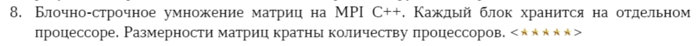

# Дополнительная ЛР #6

Условие:

Часть теории взята [http://repo.ssau.ru/bitstream/Uchebnye-izdaniya/Parallelnye-algoritmy-vychislitelnoi-lineinoialgebry-Elektronnyi-resurs-ucheb-posobie-80351/1/Головашкин%20Д.Л.%20Параллельные%20алгоритмы%20вычислительной%20линейной%20алгебры%202019.pdf](отсюда)

Лабораторная работа реализована на топологии "процессорное кольцо" с помощью MPI на C++.

## Запуск

- Скомпилировать mpi программу
- Запустить mpiexec -n {кол-во процессов} ./mpi.exe

Пример:
mpiexec -n 2 ./mpi.exe

Проверь еще, что в vscode стоит g++, а не gcc. Ты же на плюсах пишешь, а не на си.
